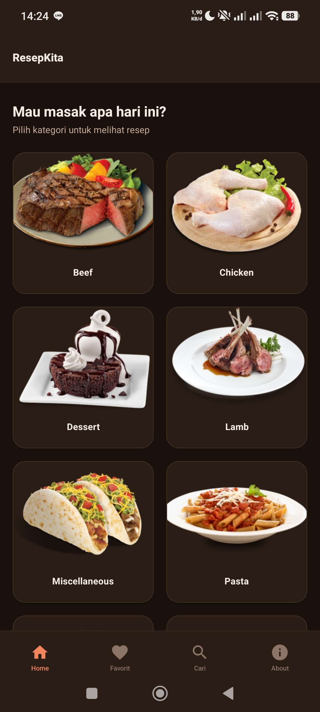
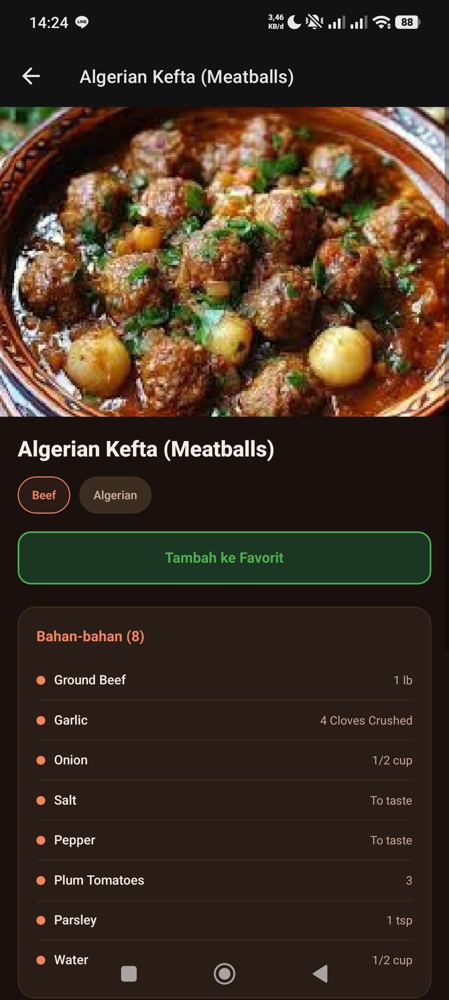
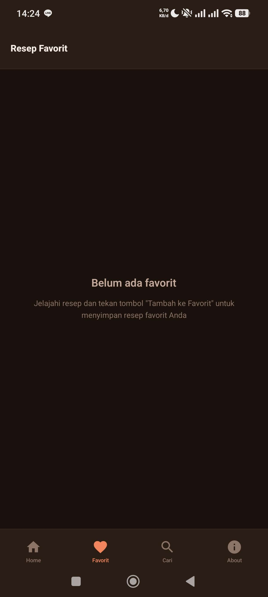
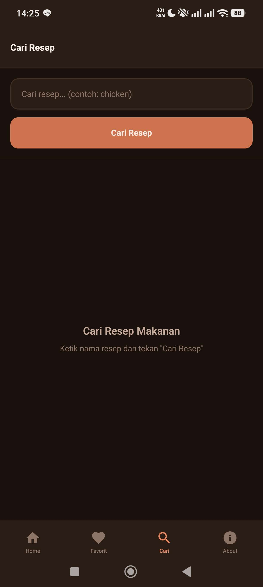
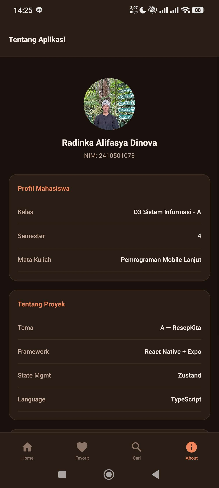

# ResepKita — Katalog Resep Kuliner

Aplikasi mobile cross-platform (React Native + Expo) berupa katalog resep makanan yang mengambil data dari TheMealDB API.

## Identitas

| Field       | Value                     |
| ----------- | ------------------------- |
| Nama        | Radinka Alifasya Dinova   |
| NIM         | 2410501073                |
| Kelas       | D3 Sistem Informasi - A   |
| Semester    | 4                         |
| Mata Kuliah | Pemrograman Mobile Lanjut |

## Tema yang Dipilih

**Tema A: ResepKita — Katalog Resep Kuliner**

NIM digit terakhir: 3 → Wajib Tema A (mapping: 0/3/6/9 = Tema A)

API: [TheMealDB](https://www.themealdb.com/api.php)

## Tech Stack

| Teknologi                      | Versi          |
| ------------------------------ | -------------- |
| React Native                   | 0.81.5         |
| Expo SDK                       | ~54.0.33       |
| TypeScript                     | ~5.9.2         |
| React Navigation (native)      | ^7.1.8         |
| React Navigation (bottom-tabs) | ^7.4.0         |
| Zustand                        | latest         |
| Expo Router                    | ~6.0.23        |
| HTTP Client                    | fetch() native |

## Cara Install & Run

```bash
# 1. Clone repository
git clone https://github.com/radincuyy/uts-mobile-lanjut-2410501073-radinkaalifasyadinova.git

# 2. Masuk ke folder project
cd uts-mobile-lanjut-2410501073-radinkaalifasyadinova

# 3. Install dependencies
npm install

# 4. Jalankan dengan Expo
npx expo start
```

Scan QR code menggunakan **Expo Go** di Android/iOS.

## Screenshot

| Screen       | Preview                               |
| ------------ | ------------------------------------- |
| Home         |          |
| Detail Resep |      |
| Favorit      |  |
| Search       |      |
| About        |        |

## Video Demo

> [Tonton Video Demo di YouTube](https://www.youtube.com/watch?v=Odr1BZIBJes)

## State Management — Zustand

### Pilihan: Zustand

### Justifikasi

Zustand dipilih sebagai state management untuk fitur favorit karena beberapa alasan:

**Kelebihan Zustand untuk kasus ini:**

1. **Boilerplate Minimal** — Dibandingkan Redux Toolkit yang membutuhkan slice, reducer, dan store configuration, Zustand hanya membutuhkan satu file store dengan fungsi `create()`.
2. **Tidak Perlu Provider** — Berbeda dengan Context API yang harus membungkus komponen tree dengan Provider, Zustand bisa langsung diakses dari komponen mana saja melalui custom hook.
3. **API Intuitif** — Cukup define state dan actions dalam satu object, lalu gunakan hook `useFavoritesStore()` di komponen.
4. **Performa Baik** — Zustand hanya me-render ulang komponen yang benar-benar menggunakan state yang berubah (selective subscription).
5. **Ukuran Kecil** — Bundle size Zustand sangat kecil (~1KB), cocok untuk aplikasi mobile.

**Kekurangan:**

1. **Tidak ada devtools bawaan** — Debugging state lebih terbatas dibanding Redux DevTools.
2. **Ecosystem lebih kecil** — Community dan middleware tidak seluas Redux.
3. **Tidak ada middleware complex** — Untuk kasus yang lebih kompleks, Redux Toolkit mungkin lebih cocok.

Untuk skala aplikasi UTS ini (hanya manage state favorit), Zustand adalah pilihan yang paling efisien dan pragmatis.

## Fitur Aplikasi

1. **HomeScreen** — Grid kategori makanan dengan pull-to-refresh dan error handling
2. **Browse Kategori** — Daftar resep per kategori
3. **DetailScreen** — Detail resep lengkap (nama, gambar, kategori, area, bahan, instruksi) + tombol favorit
4. **FavoritesScreen** — Daftar resep favorit dengan tombol hapus
5. **SearchScreen** — Pencarian resep dengan validasi input (min 3 karakter)
6. **AboutScreen** — Profil mahasiswa dan credit API

## Referensi

- [React Native Documentation](https://reactnative.dev/docs/getting-started)
- [Expo Documentation](https://docs.expo.dev/)
- [React Navigation](https://reactnavigation.org/docs/getting-started)
- [Zustand Documentation](https://docs.pmnd.rs/zustand/getting-started/introduction)
- [TheMealDB API Documentation](https://www.themealdb.com/api.php)
- [Expo Router Documentation](https://docs.expo.dev/router/introduction/)

## Refleksi Pengerjaan

> Selama pengerjaan UTS ini, saya menghadapi beberapa kesulitan. Pertama, bottom navigation bar pada Android bertumpuk dengan tombol navigasi sistem (back, home, recent apps). Untuk mengatasinya, saya harus mempelajari penggunaan `useSafeAreaInsets()` dari `react-native-safe-area-context` agar padding bawah tab bar menyesuaikan secara dinamis berdasarkan perangkat.
>
> Kesulitan kedua adalah memahami perbedaan antara controlled dan uncontrolled component di React Native. Awalnya, TextInput pada halaman Search menggunakan `useRef` dan `defaultValue` (uncontrolled), yang ternyata tidak sesuai dengan syarat tugas. Saya harus melakukan refactor agar menggunakan `useState` dan prop `value` (controlled component).
>
> Selain itu, project awal Expo menghasilkan banyak file template bawaan seperti `explore.tsx`, `hello-wave.tsx`, dan `parallax-scroll-view.tsx` yang tidak relevan dengan proyek ResepKita. Proses identifikasi dan pembersihan file-file ini membutuhkan ketelitian agar tidak menghapus file yang masih digunakan.
>
> Dari sisi state management, ini pertama kalinya saya menggunakan Zustand. Awalnya agak bingung dengan pattern `create()`, `set()`, dan `get()`, tetapi setelah memahami konsepnya, Zustand terasa jauh lebih sederhana dibandingkan Redux.
